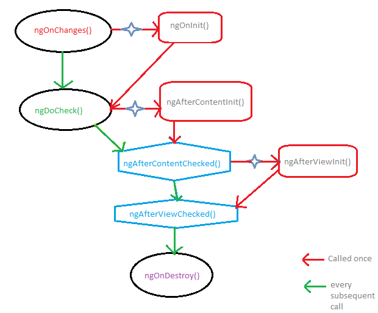
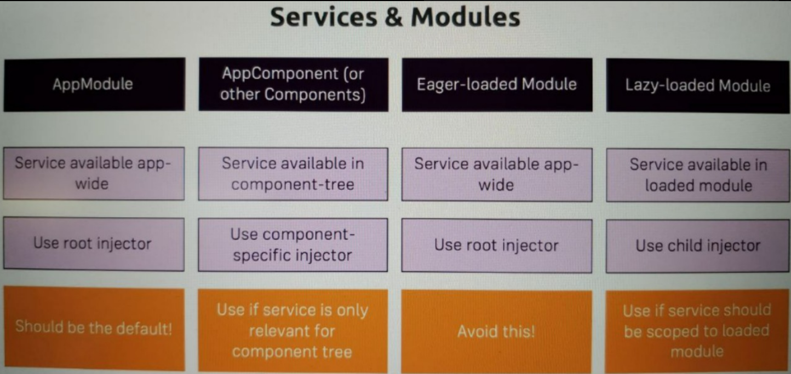

# LearnAngular
https://learn-angular-udemy-course.web.app

This project was generated with [Angular CLI](https://github.com/angular/angular-cli) version 13.3.7.

## Development server

Run `ng serve` for a dev server. Navigate to `http://localhost:4200/`. The application will automatically reload if you change any of the source files.

## Code scaffolding

Run `ng generate component component-name` to generate a new component. You can also use `ng generate directive|pipe|service|class|guard|interface|enum|module`.

## Build

Run `ng build` to build the project. The build artifacts will be stored in the `dist/` directory.

## Running unit tests

Run `ng test` to execute the unit tests via [Karma](https://karma-runner.github.io).

## Running end-to-end tests

Run `ng e2e` to execute the end-to-end tests via a platform of your choice. To use this command, you need to first add a package that implements end-to-end testing capabilities.

## Further help

To get more help on the Angular CLI use `ng help` or go check out the [Angular CLI Overview and Command Reference](https://angular.io/cli) page.

<hr>
<br>
<br>

# Notes:

- ```js
    @Component({
        selector: 'smth',
    })
  ```

Selector can be not only tag (https://angular.io/api/core/Directive#selector).
We kind of hang our logic on the markup element, and indicate the angular how
to find this markup element;

- `4` Ways of Databinding (communication between `ts` and `html`): String Interpolation,
  Property Binding, Event Binding, Two-Way-Databinding;

- `@ViewChild` and `@ContentChild` static prop - `true` to resolve query results
  before change detection runs, `false` to resolve after change detection. Defaults
  to false (https://angular.io/guide/static-query-migration);

- Lifecycle hooks:<br> ;

- Use Renderer2 instead of directly accessing the DOM (e.g. for styling);

- `HostListener('eventName')` - can also listen to custom events (can be useful
  in custom directives);

- ```js
  @HostBinding('style.backgroundColor')
  backgroundColor = 'transparent'
  ```

  nice way for accessing host element properties (e.g. for styling);

- To use the directive also as an input we need to add an alias for `@Input('alias')`
  with the same name as a directive selector or just use the same name for input property;

- Providers in Providers array are hierarchical. If we provide service inside
  component providers, then it will be available for this component and it's child
  components. This will even overwrite if we were to provide the same service on
  a higher level;

- `routerLink="/servers"` - the `/` indicates that this is an absolute path.
  Without `/` it will navigate to the relative path of the current route.
  So if the current route is `localhost:4200/servers` and in some component inside
  this route we have `routerLink="servers"` when we click on it angular will navigate
  app to `localhost:4200/servers/servers` (relevant for HTML only);

- `routerLink="../servers"` - means go back one path and then navigate to `servers`
  (just `'../'` can also be used);

- `private router: Router` service doesn't know the current active path, so
  `'../servers'`, `'servers'`, `'./servers'` won't work. We need to indicate it explicitly:

  ```js
  this.router.navigate(["servers"], { relativeTo: this.route });
  ```

  where `route` - `private route: ActivatedRoute`;

- ```js
  this.router.navigate(["edit"], {
    relativeTo: this.route,
    queryParamsHandling: "preserve",
  });
  ```

  preserve current query parameters for next route (https://angular.io/api/router/QueryParamsHandling);

- Route order. The order of routes is important because the Router uses a first-match
  wins strategy when matching routes, so more specific routes should be placed above
  less specific routes. List routes with a static path first, followed by an empty path
  route, which matches the default route. The wildcard route `**` comes last because it
  matches every URL and the Router selects it only if no other routes match first;

- `{ path: '', redirectTo: '/somewhere-else' }` - actually, Angular will give you an
  error here, because that's a common gotcha: This route will now ALWAYS redirect you
  since the default matching strategy is "prefix" (Of course every path starts with ''.
  That's no whitespace, it's simply "nothing"). Fix: `{ path: '', redirectTo: '/somewhere-else', pathMatch: 'full' }`;

- ```js
    {
        path: ':id',
        component: RecipeDetailComponent,
    },
    {
        path: 'new',
        component: RecipeEditComponent,
    },
  ```

  will cause an error, because order matters. Angular will interpret `new` as an `id`;

- Use `EventEmitter` only for `@Output()`, not like a `Subject`;

- `Template-Driven Forms`: The PatchValue is used to update only a subset of the
  elements of the FormGroup or FormArray. It will only update the matching objects
  and ignores the rest.
  The SetValue requires that the object must match the structure of the FormGroup
  or FormArray exactly. Otherwise, it will result in an error;

- ```js
    (new FormGroup({}).get('test') as FormArray).push(new FormControl(null));
  ```

  Need explicitly add as `FormArray`, otherwise `.push` will throw an error;

- HowTo Use custom validators in the template (e.g. to show the error message):
  ```js
    *ngIf="formName.get('formControlName').errors.nameOfCustomError"
  ```
- Inside custom validator if the condition for the error is not met, then you need
  to return `null`;

- Template Pipes:

  ```js
    *ngFor="let item of items | pipeName:pipeArgument1:pipeArgument2"
  ```

  ```js
    @Pipe({ name: 'pipeName', pure: true })
    export class PipeNamePipe implements PipeTransform{
      transform(value: any, ...args: any[]) {
        ...
      }
    }
  ```

  `pure`: When `true`, the pipe is pure, meaning that the transform() method is
  invoked only when its input arguments change. Pipes are pure by default.

  If the pipe has internal state (that is, the result depends on state other
  than its arguments, e.g. we will add another item into items array above
  (in the example value = items)), set pure to `false`. In this case, the
  pipe is invoked on each change-detection cycle, even if the arguments have
  not changed;

- Rxjs `catchError` operator should return or a new observable or throw an
  error using `throwError` or `throw new Error(errorMsg)` (https://rxjs.dev/api/index/function/throwError);

- ```js
  http.get(url, { observe: "response" });
  ```

  `{observe: 'response'}` is what makes the full response object available;

- `BehaviorSubject` - Requires an initial value and `emits the current value to new subscribers`;

- Angular parses every ngModule standalone, so it's not enough to export the
  components to another module, you also need to add everything they need to
  the module in which they are declared in the declaration array.
  Only root application module - AppModule should import BrowserModule. All
  other feature module should import CommonModule because we only need the
  Angular directives in feature module and not the services that are required
  launch the app (BrowserModule re-exports CommonModule for AppModule).

- Providers & Modules: [(source)](https://www.udemy.com/course/the-complete-guide-to-angular-2)
  

- With JIT (Just-In-execution-Time) compilation Angular template compiler runs in browser
  so this compiler also part of build code in the browser;
